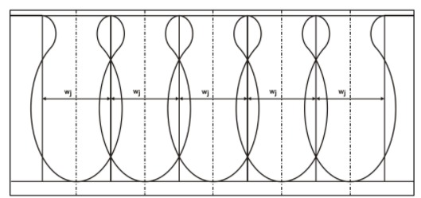

# TSHD_production_estimation
An object to model a Trailing Suction Hopper Dredger and it's dredging arm components in order to estimate the mixture density under certain assumptions, mostly based on Miedema (2014). 
# Jet production

# Theory and formulae
## Estimating Jet Production
###  Jet depth 
For the determination of the jet layer thickness there are two methods. Namely the CSB (Combinatie Speurwerk Baggertechniek) method and the method by S. Miedema. Both methods are used to compare and are shown here below. 

\begin{equation}
    h_{i,jet,CSB}= \frac{291*p*0.59*(D_{nozzle}*1000)^{0.49}*k*100^{\frac{0.369}{1000}}}{v_{c}}
\end{equation}

\begin{equation}
    h_{i,jet,Miedema}= 2 * \frac{(\Delta p_j)^\frac{1}{2}* D^\frac{2}{3} * k_{i}^\frac{1}{3}}{v_{c}} 
\end{equation}

where:

$$p_{j} = \mbox{pressure at the jet}$$
$$D_{nozzle} = \mbox{width of the nozzles}$$
$$k = \mbox{permeability of the sand}$$

Apparently, the production of one nozzle is a constant and not depending on the trailing speed, given the assumption
and simplification that β and v1 are both about unity.

uitleg:
$H_{i,jet}$ must be limited because at low speeds. 

###  Draghead pressure 

The following equation is used for the calculation of the draghead pressure. 
\begin{equation}
    p_{draghead}=h_{i}*w_{jet}*v_{c}*nozzles*(1-n)
\end{equation}
where:

$$h_{i} = \mbox{cut layer thickness[m]}$$
$$v_{c} = \mbox{trailing speed [m/s]}$$
$$nozzles = \mbox{number of nozzles[-]}$$
$$n = \mbox{porosity}$$
$$ w_{jet} = \mbox{Jet Cavity Width}$$
$$ VW_{ratio} = \mbox{Velocity Width Ratio}$$
$$ \beta_{jet} = \mbox{Power of Effective Width Trailing Speed Dependency}$$

With:

\begin{equation}
    w_{jet} = h_{i}*(v_{c}/VW_{ratio}^{\beta_jet}
\end{equation}

It can be observed that the pressure of the draghead is dependent on the trailing speed. The layer thickness has a limit value and becomes smaller as the trailing speed increases. w is limited aswell because the cavitation spray by the the nozzles is overlapping each other as shown in the picture below. Based on this width the desing of the draghead is made and the distance between the nozzles will be based on the cavitation width. 

### Volumestroom $Q_{pipe}$

\begin{equation}
    Q_{pipe} =\frac{\pi}{4} * D_{pipe}^2 * V_{I} 
\end{equation}
where:

$$ Q_{pipe} = \mbox{Volumetric flow rate [m^3/s]} $$
$$ D_{pipe} = \mbox{Diameter pipe [m]} $$
$$ V_{I} = \mbox{Flow speed in pipe [m/s]} $$

uitleg:

$Q_{pipe}$ is the volumetric flow rate  of material that flows true suction the pipe which consists of a mixture of Sand and water. 

### Constant Volume System 

Spatial Volumetric concentration 
\begin{equation}
    C_{vs} =\frac{p_{draghead}}{D_{pipe}}
\end{equation}

where:

$$C_{vs} = \mbox{spatial Volumetric concentration[-]}$$
$$p_{draghead} = \mbox{pressure in the draghead at seafloor[N/m^2]} $$
$$D_{pipe} = \mbox{Diameter pipe [m]}$$

### Mixture density

\begin{equation}
    \rho_{mixture}=(1-cvs)*\frac{\rho_{water}}{1000}+cvs*\frac{\rho_{sand}}{1000}
\end{equation}

Where:
$$\rho_{water} = \mbox{Density of water [kg/m^3]}$$
$$\rho_{sand} = \mbox{Density of sand [kg/m^3]}$$
$$\rho_{mixture} = \mbox{Density of material sucked up [kg/m^3]}$$

With this formula the density of the material in the pipe is calculated, it exist of water and sand in this situation.

## Estimating Cutting Production based on Moment Balance

### Gravity force

To determine the gravity force of the visor when it is submerged under water, there has to be accounted for the density of the (sea)water. A relative density has to be calculated with the following formula:

$$
\rho_{relative} = (\rho_{steel} - \rho_{water})/\rho_{steel}
$$

The gravity force of the submerged visor can be computed by multiplying the weight of the visor with the relative density and the gravitational acceleration as the equation below describes.

$$
F_{g} = m_{visor}*\rho_{relative}*g
$$

The gravity force of the visor causes a (+/-) moment on the visor hinge. It's operating point is located at the horizontal and vertical positions $G_{x,v}$ and $G_{y,v}$ with respect to the visor hinge.

### Shear angle

The blades/teeth of the visor exert a force on the sand which causes the sand particles to move, changing its initial packed grain structure. Due to this movement the volume of the excavated sand, positioned on the blades, increases because little space is created between the still closely packed sand. The space between the particles is then filled with water and pressure differences occur between the pores, resulting in an increase of the grain stresses and also higher cutting forces. This phenomenon is called dilatancy. An increase of the cutting velocity causes a rise of the pressures in the pores. Eventually this pressure can reach the saturated water vapour pressure and cavitation will occur. For the determination of the shear angle a cavitating process is considered. As a result there has been assumed that there are no pressure difference in the pores and therefore the streamlines have not ot be accounted for. Based on the minimum energy principle an approximation of the shear angle can be determined numerically. This value is depending on the blade angle, the layer thickness ratio, the angle of internal friction and the steel-sand friction angle. The equation is stated below.  

$$
\beta = 1 - \frac{1}{6}\cdot\alpha - \frac{2}{7}\cdot(\phi + \delta) - 0.057\cdot\frac{h_{b}}{h_{i}}
$$

### Dimensionless cutting force

After the shear angle is determined by the minimal energy principle, the dimensionless cutting forces in the horizontal and vertical direction can be calculated, still assuming that only cavitation occurs. For the horizontal and vertical component of the dimensionless cutting force the following equations are used respectively.

$$
d_{1} = \frac{(\frac{sin(\phi)}{sin(\beta)}+\frac{h_{b} \cdot sin(\alpha + \beta + \phi)}{sin(\alpha)}) \cdot sin(\alpha + \beta)}{sin(\alpha + \beta + \delta + \phi)}-\frac{h_{b} \cdot sin(\alpha)} {h_{i} \cdot sin(\alpha)}
$$

and 

$$
d_{2} = \frac{(\frac{sin(\phi)}{sin(\beta)}+\frac{h_{b} \cdot sin(\alpha + \beta + \phi)}{sin(\alpha)}) \cdot sin(\alpha + \beta)}{sin(\alpha + \beta + \delta + \phi)}-\frac{h_{b} \cdot cos(\alpha)} {h_{i} \cdot sin(\alpha)}
$$

### Cutting force

For the calculation of the cutting forces it is assumed that inertia, gravitation, adhesion and cohesion can be neglected. By using the horizontal and vertical dimensionless cutting forces, the real horizontal and vertical cutting forces can be determined by using the equations below. 

$$
F_{c,hor} = d_{1} \cdot \rho_{w} \cdot g \cdot (z + 10) \cdot h_{i} \cdot w
$$ 

and

$$
F_{c,ver} = d_{2} \cdot \rho_{w} \cdot g \cdot (z + 10) \cdot h_{i} \cdot w
$$

The forces are working at a certain x- and y-distance from the visor hinge. These coordinates can be calculated by taking the sine and cosine of the visor angle and multiplying it with the distance between the hinge and the blades of the visor resulting in the following equations for the vertical and horizontal arm respectively. 

$$
R_{F_{c,hor}} = R_{v} \cdot sin(\theta)
$$

and

$$
R_{F_{c,ver}} = R_{v} \cdot cos(\theta)
$$

### Determining visor angle from moment balance

Moment balance:

$$
(G_{x,v}\cdot\cos{\theta} + G_{y,v}\cdot\sin{\theta})\cdot F_g - (\sin{\theta}\cdot R_v + \sin{\alpha} \cdot l_b) \cdot F_{cut,h} = 0 
$$

Solving for $\theta$ becomes:

$$
(G_{x,v} + G_{y,v}\cdot\tan{\theta})\cdot F_g - \tan{\theta}\cdot R_v \cdot F_{cut,h} -  \frac{h_b}{\cos{\theta}} \cdot F_{cut,h} = 0 
$$

$$
G_{x,v}\cdot F_g + (G_{y,v}\cdot F_g - R_v \cdot F_{cut,h}) \cdot\tan{\theta} - \frac{h_b}{\cos{\theta}} \cdot F_{cut,h} = 0 
$$

Thus follows:
$$
\tan{\theta} = \frac{\frac{h_b}{\cos{\theta}} \cdot F_{cut,h} -  G_{x,v}\cdot F_g}{G_{y,v}\cdot F_g - R_v \cdot F_{cut,h}}
$$

We have to solve this iteratively, which is done in [REFERENCE CORRECT FUNCTION]

# Programmatic implementation

With the above formulae one can determine:
- The cutting depth and force as a result of the visor angle
- The visor angle that is prescribed by the moment balance 

In order to obtain a cutting depth and visor angle which satisfies the moment balance at a certain trailing velocity we need to iteratively change the visor angle and recalculate the cutting forces. This is done through the bisection method.

# List of symbols

## General parameters
$$p = \mbox{Reference pressure}$$
$$\rho_w = \mbox{Water density}$$
$$\rho_{sand} = \mbox{Sand density}$$
$$\rho_{steel} = \mbox{Water density}$$
$$ k = \mbox{Permeability}$$
$$ \eta = \mbox{In-situ Porosity}$$
$$ \phi = \mbox{Angle of Internal Friction}$$
$$ \delta = \mbox{Steel-Sand Friction Angle}$$
$$ z = \mbox{Waterdepth}$$

## TSHD Parameters
$$ v_c = \mbox{Trailing Velocity / Cutting Velocity}$$
$$ D_{pipe} = \mbox{Pipe Diameter}$$
$$ v_l = \mbox{Linespeed}$$

## Blade Parameters
$$ h_b = \mbox{Blade Height}$$
$$ w_b = \mbox{Blade Width}$$
$$ l_b = \mbox{Blade Lenght}$$
$$ \alpha = \mbox{Blade Angle}$$

## Visor Parameters
$$ w_v = \mbox{Visor Width}$$
$$ R_v = \mbox{Visor Radius}$$
$$ \theta = \mbox{Visor Angle}$$
$$ G_{x,v} = \mbox{Center of Gravity in x-direction, Visor}$$
$$ G_{y,v} = \mbox{Center of Gravity in y-direction, Visor}$$
$$ \omega = \mbox{Angle of Lower Suction Pipe}$$

## Jet Parameters
$$ D_{nozzle} = \mbox{Nozzle diameter}$$
$$ v_{jet} = \mbox{Jet Exit Velocity}$$
$$ N_{nozzles} = \mbox{Number of nozzles}$$
$$ w_{jet} = \mbox{Jet Cavity Width}$$
$$ VW_{ratio} = \mbox{Velocity Width Ratio}$$
$$ \beta_{jet} = \mbox{Power of Effective Width Trailing Speed Dependency}$$

## Forces & Moments
$$ d_1 = \mbox{Non-dimensional Horizontal Cutting Force}$$
$$ d_2 = \mbox{Non-dimensional Vertical Cutting Force}$$
$$ F_{c,hor} = \mbox{Horizontal Cutting Force}$$
$$ F_{c,ver} = \mbox{Vertical Cutting Force}$$
$$ F_g = \mbox{Gravity Force}$$
$$ R_{Fc,h} = \mbox{Arm Horizontal Cutting Force}$$
$$ R_{Fg} = \mbox{Arm Gravity Force}$$

$$ M_{res} = \mbox{Resulting Moment}$$

# Possible Improvements
- Blade angle not dependent on visor angle
- Include other forces
- Check cavitation
- Optimal blade angle
- From specific cutting energy and installed power to theoretical cutting production
- Observe effects of wear on blade

# References
Miedema, S. A. (2014). The Delft Sand, Clay and Rock Cutting Model. Amsterdam, Nederland: Amsterdam University Press.
